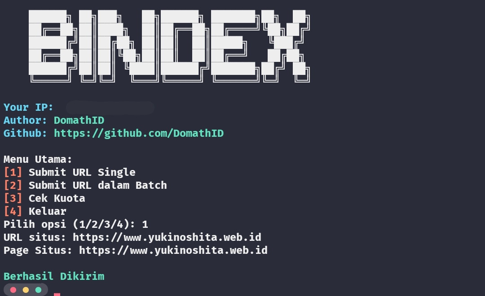

# BINDEX
<p>Useful tools for submitting sites to bing webmaster with just an apiYou have to store the api key in the api.text file, and to get it just go to bing webmaster</p>

# How to Use
```
git clone https://github.com/DomathID/bing-url
cd bing-url
pip install -r requirements.txt
python bing.py
```
# Preview

